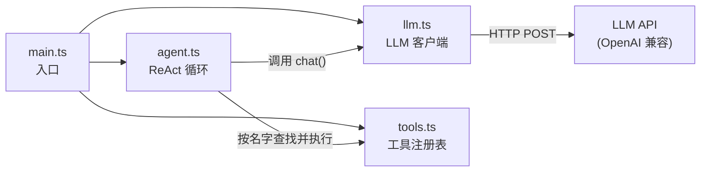
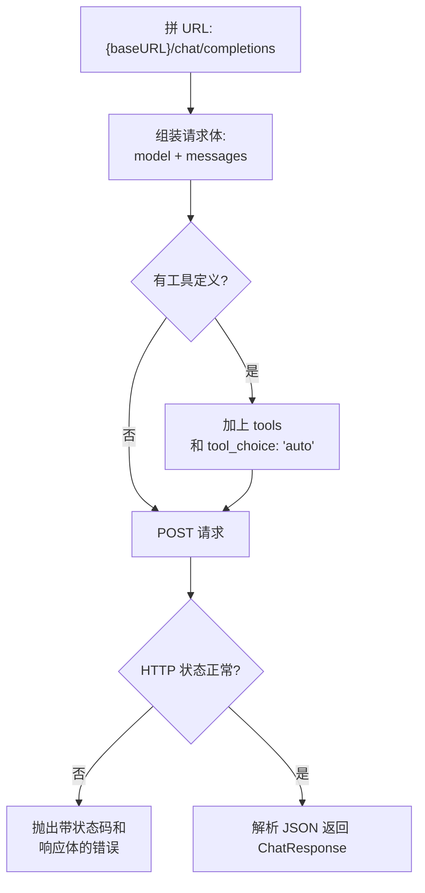
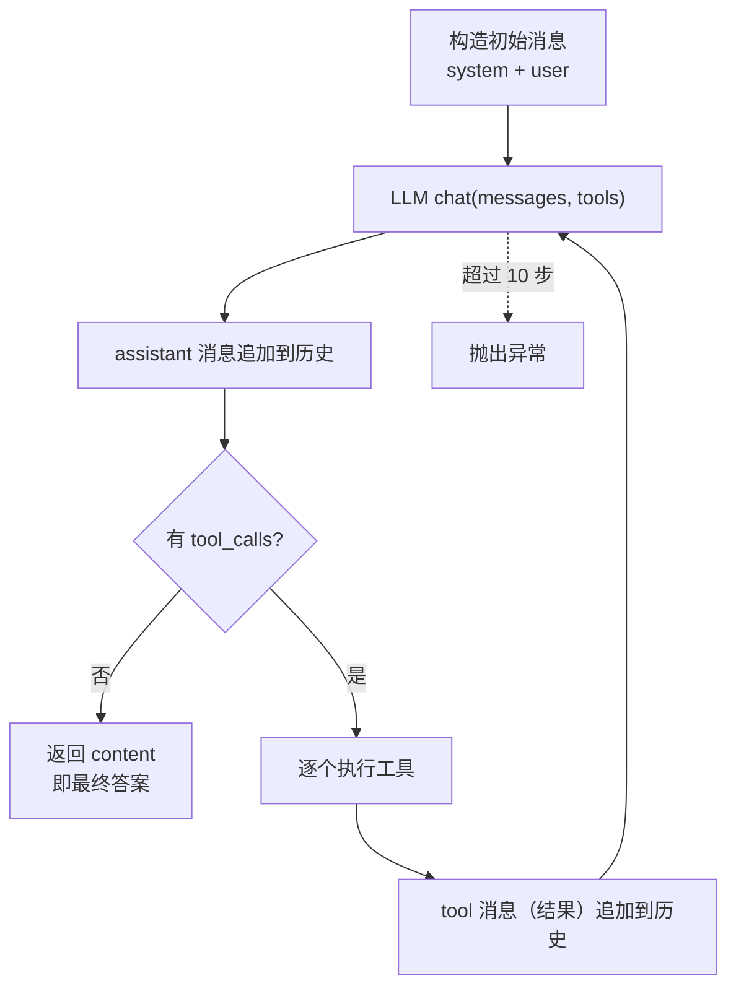

# 用 200 行 TypeScript 手写一个 ReAct Agent

本教程基于 `01ReAct/` 目录下的代码，从零讲解一个最小可运行的 ReAct（Reasoning + Acting）Agent 是如何工作的。整个实现不依赖任何 Agent 框架，只用原生 `fetch` 调用 LLM API，约 200 行代码。

## 什么是 ReAct

ReAct 的核心思想是：让 LLM 在一个**循环**中交替进行"推理"和"行动"：

```
        ┌──────────────────────────────────────────┐
        │                                          │结果追加到对话历史
        ▼                                          │
   ┌─────────┐    请求调用工具    ┌──────┐    ┌──────────┐
   │   LLM   │ ───────────────▶ │ 工具  │ ─▶ │ 执行结果  │
   └─────────┘                  └──────┘    └──────────┘
        │                                         
        │ 直接回复文字（无工具调用）                   
        ▼                                          
     最终答案               
```

1. LLM 看到问题，决定调用一个工具（Action）
2. 程序真正执行这个工具，把结果（Observation）追加到对话历史
3. LLM 带着新的历史再次推理，决定下一步
4. 当 LLM 不再调用工具时，它的回复就是最终答案

以项目中的示例问题 `计算 123 * 456, 然后再加100` 为例：

```
Step 1:  LLM ──▶ calculator(123, "*", 456) ──▶ 56088
Step 2:  LLM ──▶ calculator(56088, "+", 100) ──▶ 56188
Step 3:  LLM ──▶ 直接输出最终答案
```

## 准备工作

### 安装依赖

```bash
npm install
```

项目只依赖 `dotenv`（读取环境变量）和 `tsx`（直接运行 TypeScript）。

### 配置环境变量

在项目根目录创建 `.env` 文件，填入任意 OpenAI 兼容 API 的配置：

```bash
LLM_BASE_URL=https://api.openai.com/v1
LLM_API_KEY=sk-xxxx
LLM_MODEL=gpt-4o-mini
```

### 运行

```bash
npx tsx 01ReAct/main.ts
```

你会看到类似这样的输出：

```
=================Step 1==========
Action: calculator
Action Input: {"a":123,"operator":"*","b":456}
Observation: { success: true, result: 56088 }

=================Step 2==========
Action: calculator
Action Input: {"a":56088,"operator":"+","b":100}
Observation: { success: true, result: 56188 }

=================Step 3==========

==============Final Answer========
123 * 456 + 100 = 56188
```

## 代码结构与调用关系

```
01ReAct/
├── llm.ts    # LLM 客户端：类型定义 + OpenAI 兼容 API 调用
├── tools.ts  # 工具定义：calculator 工具及其注册表
├── agent.ts  # Agent 核心：ReAct 循环
└── main.ts   # 入口：组装并运行
```

四个模块的依赖关系：



## 第一步：LLM 客户端（llm.ts）

这一层负责和 LLM API 通信，是整个项目里唯一直接接触网络的部分。

### 类型定义

文件开头定义了几个关键类型，它们就是 OpenAI Chat Completions API 的数据结构：

```ts
export type Message =
  | { role: "system"; content: string }
  | { role: "user"; content: string }
  | { role: "assistant"; content: string | null; tool_calls?: ToolCall[] }
  | { role: "tool"; tool_call_id: string; content: string };
```

四种角色的消息在对话中各司其职：

```
┌───────────┬────────────────────────────────────────────┐
│ system    │ 设定 Agent 的行为准则                        │
│ user      │ 用户提出的问题                               │
│ assistant │ 模型的回复，可携带 tool_calls（要求调用工具）  │
│ tool      │ 工具的执行结果，用 tool_call_id 关联调用      │
└───────────┴────────────────────────────────────────────┘
```

另外两个类型：

- `ToolCall`：模型返回的一次工具调用。注意 `function.arguments` 是 **JSON 字符串**，需要程序自己 `JSON.parse`。
- `ToolDefinition`：告诉模型"有哪些工具可用"，本质是一个 JSON Schema 描述。

### LLMClient 接口

```ts
export interface LLMClient {
  chat(messages: Message[], tools?: ToolDefinition[]): Promise<ChatResponse>;
}
```

Agent 只依赖这个接口，不依赖任何具体的 LLM 厂商。`OpenAICompatibleClient` 是它的实现——任何兼容 OpenAI 格式的服务（OpenAI、DeepSeek、本地 vLLM 等）都能用。

### OpenAICompatibleClient

`chat()` 方法的流程：



对应代码：

```ts
const body: Record<string, unknown> = {
  model: this.model,
  messages,
};

if (tools && tools.length > 0) {
  body.tools = tools;
  body.tool_choice = "auto";   // 让模型自己决定是否调用工具
}
```

`tool_choice: "auto"` 是关键：模型看到问题后自主选择直接回答还是调用工具。

### createLLMClient 工厂函数

```ts
const baseURL = process.env.LLM_BASE_URL;
const apiKey = process.env.LLM_API_KEY;
const model = process.env.LLM_MODEL;
```

从环境变量读取配置，缺任何一个就直接报错。这样 `main.ts` 不需要知道具体的客户端类名。

## 第二步：工具（tools.ts）

工具是 Agent 的"手"。每个工具分两部分：

```
┌────────────┬──────────────────────────────────────────┐
│ definition │ 给 LLM 看：名字、描述、参数 JSON Schema     │
│ execute    │ 给程序跑：真正的实现                        │
└────────────┴──────────────────────────────────────────┘
```

```ts
export type Tool = {
  definition: ToolDefinition;
  execute(args: unknown): unknown | Promise<unknown>;
};
```

### calculator 工具

项目里只实现了一个工具 `calculator`，做四则运算：

```ts
const calculator: Tool = {
  definition: {
    type: "function",
    function: {
      name: "calculator",
      description: "Perform basic mathematical calculations",
      parameters: {
        type: "object",
        properties: {
          a: { type: "number" },
          operator: { type: "string", enum: ["+", "-", "*", "/"] },
          b: { type: "number" },
        },
        required: ["a", "operator", "b"],
        additionalProperties: false,
      },
    },
  },

  execute(args) {
    const { a, operator, b } = args as CalculatorArgs;
    switch (operator) {
      case "+": return a + b;
      case "-": return a - b;
      case "*": return a * b;
      case "/":
        if (b === 0) throw new Error("division by zero");
        return a / b;
    }
  },
};
```

`definition` 会被原样发给 LLM——模型根据 `name`、`description` 和参数 schema 决定什么时候调用、传什么参数。`execute` 则只在本地运行，模型看不到它的实现。

### 工具注册表

```ts
export const tools = new Map<string, Tool>();
tools.set(calculator.definition.function.name, calculator);
```

用 `Map` 按名字注册工具。Agent 执行时按名字查找，加新工具只需再 `set` 一个。

## 第三步：Agent 核心循环（agent.ts）

这是 ReAct 的心脏，全部逻辑在 `Agent.run()` 方法里。先看整体流程：



### 构造消息列表

```ts
const messages: Message[] = [
  { role: "system", content: "You are a helpful agent. Use tools when necessary." },
  { role: "user", content: question },
];
```

对话从一个 system prompt 和用户问题开始。整个循环中，`messages` 数组会不断变长——它就是 Agent 的"记忆"，每次调用 LLM 都完整发送。

### 主循环

```ts
const maxSteps = 10;
for (let step = 0; step < maxSteps; step++) {
  // ...
}
```

`maxSteps` 是保险丝：防止 LLM 陷入无限调用工具的循环，超过 10 步就抛错。

循环体每一轮做三件事：

**1. 调用 LLM**

```ts
const response = await this.llm.chat(messages, definitions);
```

把当前完整的对话历史和所有工具定义发过去。

**2. 把模型的回复追加到消息历史**

```ts
messages.push({
  role: "assistant",
  content: message.content,
  tool_calls: message.tool_calls,
});
```

**3. 判断：有工具调用吗？**

```ts
const toolCalls = message.tool_calls ?? [];
if (toolCalls.length === 0) {
  return message.content ?? "";  // 没有 → 循环结束，这就是最终答案
}
```

这是循环唯一的正常出口：**模型不再调用工具时，它的文本回复就是答案**。

### 执行工具

如果有工具调用，逐个执行：

```ts
const tool = this.tools.get(name);
if (!tool) {
  observation = { success: false, error: `Unknown tool: ${name}` };
} else {
  try {
    const args = JSON.parse(call.function.arguments);
    const result = await tool.execute(args);
    observation = { success: true, result };
  } catch (error) {
    observation = { success: false, error: /* 错误信息 */ };
  }
}
```

注意两个分支都不会让程序崩溃：

- 工具不存在 → 把 `Unknown tool` 错误反馈给模型
- 执行抛异常 → 把错误信息包装成 observation 反馈给模型

### 把结果反馈给模型

```ts
messages.push({
  role: "tool",
  tool_call_id: call.id,
  content: JSON.stringify(observation),
});
```

`tool` 消息通过 `tool_call_id` 和模型的调用对应起来（模型可能一次请求多个工具）。然后循环继续，模型在下一轮会看到工具的执行结果。

### 消息数组的完整演变

以 `计算 123 * 456, 然后再加100` 为例，`messages` 数组是这样一步步变长的：

```
初始:
  [0] system:    "You are a helpful agent..."
  [1] user:      "计算 123 * 456, 然后再加100"
        │
        │  Step 1：LLM 要求调用 calculator
        ▼
  [2] assistant: tool_calls=[calculator(123,"*",456)]   ← id: call_1
  [3] tool:      {"success":true,"result":56088}        ← tool_call_id: call_1
        │
        │  Step 2：LLM 看到 56088，再要求调用 calculator
        ▼
  [4] assistant: tool_calls=[calculator(56088,"+",100)] ← id: call_2
  [5] tool:      {"success":true,"result":56188}        ← tool_call_id: call_2
        │
        │  Step 3：LLM 看到 56188，不再调用工具
        ▼
  [6] assistant: content="123 * 456 + 100 = 56188"      ← 循环结束，返回
```

## 第四步：入口（main.ts）

入口只做一件事：组装。

```ts
const llm = createLLMClient();        // 从环境变量创建 LLM 客户端
const agent = new Agent(llm, tools);  // 注入客户端和工具表
const answer = await agent.run("计算 123 * 456, 然后再加100");
```

`Agent` 通过构造函数接收依赖，所以它不关心你用哪个 LLM 服务、有哪些工具——这些都由入口决定。

## 动手练习：添加一个新工具

理解了代码后，试着加一个工具，比如获取当前时间。在 `tools.ts` 中：

```ts
const getCurrentTime: Tool = {
  definition: {
    type: "function",
    function: {
      name: "get_current_time",
      description: "Get the current date and time",
      parameters: {
        type: "object",
        properties: {},       // 无参数
        additionalProperties: false,
      },
    },
  },
  execute() {
    return new Date().toISOString();
  },
};

tools.set(getCurrentTime.definition.function.name, getCurrentTime);
```

然后在 `main.ts` 里问 `"现在几点了？"`——不需要改 `agent.ts` 的任何代码，循环会自动把这个新工具的 definition 发给模型，模型会自己决定调用它。
