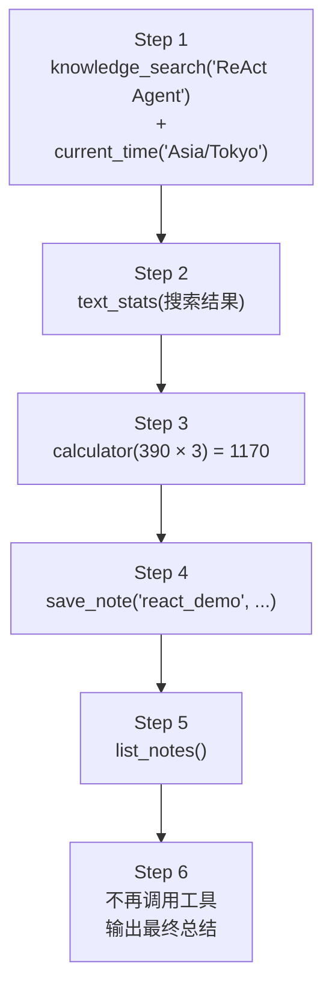
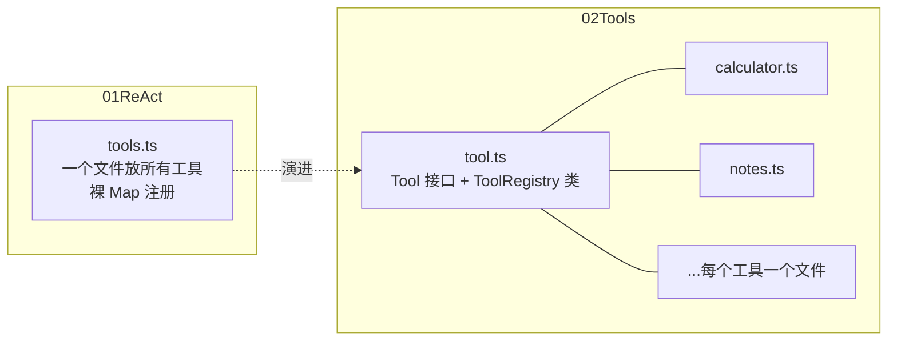

# 02 · Tools：构建一个多工具的 Agent

上一章（`01ReAct`）用一个 `calculator` 工具跑通了 ReAct 循环。本章在同样的循环骨架上，把工具系统扩展成一个更完整的形态：

- 工具从一个变成六个，涵盖计算、文本统计、时间、检索、存储
- 引入 **ToolRegistry** 类，统一管理工具的注册、查找和执行
- 引入 **ToolContext**，让工具之间可以共享运行时状态
- 用更详细的 system prompt 指导模型进行多步工具编排

## 本章的演示任务

`main.ts` 给 Agent 布置了一个七步任务：

```
1. 使用 knowledge_search 搜索 ReAct Agent 的相关知识
2. 使用 text_stats 统计搜索结果内容的字符数
3. 使用 calculator 计算这个字符数乘以 3
4. 使用 current_time 查询 Asia/Tokyo 当前时间
5. 把计算结果和当前时间通过 save_note 保存，key 为 react_demo
6. 使用 list_notes 确认保存成功
7. 最后给出总结
```

任务之间存在数据依赖（第 2 步依赖第 1 步的结果，第 3 步依赖第 2 步），Agent 必须在多轮循环中把中间结果传递下去。实际运行轨迹：



注意 Step 1 里模型**一次发起了两个工具调用**（搜索和查时间互不依赖），这是 Chat Completions API 支持的能力：一条 assistant 消息可以携带多个 `tool_calls`，程序逐个执行后把结果一一对应地追加回历史。

## 代码结构

```
02Tools/
├── types.ts             # 类型定义：Message / ToolCall / ToolDefinition / 响应
├── llm.ts               # LLM 客户端（与上一章相同的 OpenAI 兼容实现）
├── tool.ts              # Tool 接口、ToolContext、ToolRegistry
├── calculator.ts        # 工具：四则运算 + 幂
├── text-stats.ts        # 工具：文本统计
├── current-time.ts      # 工具：当前时间（支持时区）
├── knowledge-search.ts  # 工具：本地知识库检索
├── notes.ts             # 工具：保存 / 列出笔记（读写共享状态）
├── agent.ts             # Agent：ReAct 循环
└── main.ts              # 入口：组装 + 演示任务
```

相比上一章，结构上有两个变化：



`types.ts` 把消息和 API 的类型抽成了独立文件，同时把 `Message` 联合类型拆成了 `SystemMessage` / `UserMessage` / `AssistantMessage` / `ToolMessage` 四个具名类型，`ChatResponse` 也重命名为 `ChatCompletionResponse`。`llm.ts` 的实现与上一章相同，不再赘述。

## Tool 接口与 ToolContext（tool.ts）

本章的 `Tool` 从 `type` 升级为 `interface`，并且 `execute` 多了第二个参数：

```ts
export type ToolContext = {
  notes: Map<string, string>;
};

export interface Tool {
  definition: ToolDefinition;

  execute(
    args: unknown,
    context: ToolContext,
  ): unknown | Promise<unknown>;
}
```

`ToolContext` 是**所有工具共享的运行时状态**。它的用途在 `notes.ts` 里看得最清楚：

```ts
// saveNoteTool
execute(args, context) {
  const { key, content } = args as SaveNoteArgs;
  context.notes.set(key, content);      // 写入共享状态
  return { saved: true, key };
}

// listNotesTool
execute(_args, context) {
  return Object.fromEntries(context.notes.entries());  // 读出共享状态
}
```

`save_note` 写入的笔记，`list_notes` 能读到——两个工具通过 `context` 间接通信。这个 `context` 由 Agent 持有（`agent.ts` 第 15 行创建），在每次执行工具时传入：

```
        Agent 持有
   ┌───────────────────┐
   │  context.notes    │ ◀────── 同一份 Map
   └───────────────────┘
      │            │
      ▼            ▼
  save_note    list_notes
  （写入）      （读取）
```

工具由此可以操作对话历史之外的持久状态，而接口本身保持不变。

## ToolRegistry（tool.ts）

上一章用裸 `Map` 存工具，执行时的错误处理写在 Agent 里。本章把这两件事都收进了 `ToolRegistry`：

```ts
export class ToolRegistry {
  private readonly tools = new Map<string, Tool>();

  register(tool: Tool): void {
    const name = tool.definition.function.name;
    if (this.tools.has(name)) {
      throw new Error(`Tool already exists: ${name}`);
    }
    this.tools.set(name, tool);
  }

  definitions(): ToolDefinition[] {
    return [...this.tools.values()].map(tool => tool.definition);
  }

  async execute(name, args, context): Promise<ToolExecutionResult> {
    const tool = this.tools.get(name);
    if (!tool) {
      return { success: false, error: `Unknown tool: ${name}` };
    }
    try {
      const result = await tool.execute(args, context);
      return { success: true, result };
    } catch (error) {
      return { success: false, error: /* 错误信息 */ };
    }
  }
}
```

三个方法各管一件事：

| 方法 | 职责 | 调用时机 |
| --- | --- | --- |
| `register` | 注册工具，重名直接抛错 | 启动时（`main.ts`） |
| `definitions` | 收集所有工具的 schema | Agent 每次调用 LLM 前 |
| `execute` | 按名查找、执行、把结果/异常统一包装成 `ToolExecutionResult` | 循环中每次工具调用 |

上一章散落在 Agent 里的 `try/catch` 和 `Unknown tool` 判断，现在都收敛到 `execute` 内部。Agent 拿到的永远是统一形状的结果：

```ts
type ToolExecutionResult =
  | { success: true; result: unknown }
  | { success: false; error: string };
```

这个统一的结果对象会被 `JSON.stringify` 后作为 `tool` 消息反馈给模型——成功时模型读到结果，失败时模型读到错误信息，可以在下一轮自我纠正。

## 六个工具

每个工具都是同一个模式的实例：`definition`（给模型看的 schema）+ `execute`（本地实现）。除此之外，本章的工具有两个共同点：

- `execute` 开头先做**运行时类型检查**（如 `typeof a !== "number"` 就抛错），因为参数来自模型生成的 JSON，类型断言之外再加一道防线
- schema 的每个参数都带 `description`，`description` 写明了"什么时候该用这个工具"——模型选择工具的唯一依据就是这些文字

### calculator（calculator.ts）

在上一章基础上把操作符从符号改为单词枚举，并新增 `power`：

```ts
operation: "add" | "subtract" | "multiply" | "divide" | "power"
```

`default` 分支抛出 `Unknown operation`——模型传了枚举之外的操作时，错误会作为 observation 反馈回去。

### text_stats（text-stats.ts）

输入一段文本，返回四项统计：

```ts
return {
  characters: text.length,
  characterWithoutSpaces: text.replace(/\s/g, "").length,
  words: text.trim().split(/\s+/).filter(Boolean).length,
  lines: text.split(/\r?\n/).length,
};
```

演示任务中它接收的是上一步 `knowledge_search` 的结果——模型自己把上一步 observation 里的文本拼接成了这一步的参数，这就是工具间的数据传递。

### current_time（current-time.ts）

可选参数 `timezone`（IANA 时区名）。不传时返回 ISO 字符串和时间戳；传了就用 `Intl.DateTimeFormat` 按指定时区格式化，时区非法时抛错。

### knowledge_search（knowledge-search.ts）

一个模拟的本地知识库检索，演示"检索类工具"的完整形态：

```ts
const words = query.toLowerCase().split(/\s+/);

const results = knowledgeBase.map(item => {
  const text = `${item.id} ${item.content}`.toLowerCase();
  const score = words.filter(word => text.includes(word)).length;  // 命中词数即得分
  return { ...item, score };
}).filter(item => item.score > 0)
  .sort((a, b) => b.score - a.score);
```

按"查询词命中数"打分、过滤零分、按分数排序。真实项目中这里会换成向量检索或全文索引，但对 Agent 来说接口完全一样——它只看到 `knowledge_search(query)`。

### save_note / list_notes（notes.ts）

前面讲 `ToolContext` 时已经看过，这是本章唯一一对读写共享状态的工具。

## Agent 循环的变化（agent.ts）

循环骨架与上一章相同，细节上有三处变化。

### 1. 工具执行下沉到 Registry

上一章 Agent 自己做查找、`JSON.parse`、try/catch；本章 Agent 只解析参数，执行完全委托：

```ts
let args: unknown;
try {
  args = JSON.parse(call.function.arguments);
} catch {
  args = {};   // 模型生成了非法 JSON 时，用空对象兜底
}

const observation = await this.tools.execute(toolName, args, this.context);
```

`JSON.parse` 失败的兜底从"报错反馈给模型"变成了"传空对象"——无参数工具（如 `list_notes`）因此即使拿到非法参数也能执行。

### 2. 更详细的 system prompt

上一章的 prompt 只有两句话，本章写成了一组规则：

```
1. Never fabricate a tool result.
2. If a tool can provide a more reliable answer, prefer using the tool.
3. You may call multiple tools.
4. You may call tools sequentially.
5. A later tool call may depend on the Observation returned by an earlier tool.
6. After receiving tool results, reason about whether another tool is needed.
7. Only return the final answer when the task is complete.
```

这些规则正好对应多工具场景下模型需要知道的事：可以并行调用（3）、可以串行依赖（5）、拿到结果后继续判断（6）、任务完成才收口（7）。最后还有一句关键的角色声明：

```
The host application executes tools.
You only request tool calls.
```

模型只"请求"调用，真正执行的是宿主程序——这正是 `tool_calls` 机制的本质。

### 3. maxSteps 从 10 提到 20

工具多了、任务链长了，循环上限相应放宽。

## 入口（main.ts）

入口依然是组装，但组装的零件变多了：

```ts
const llm = new OpenAICompatibleClient(baseURL, apiKey, model);

const tools = new ToolRegistry();
tools.register(calculatorTool);
tools.register(textStatsTool);
tools.register(currentTimeTool);
tools.register(knowledgeSearchTool);
tools.register(saveNoteTool);
tools.register(listNotesTool);

const agent = new Agent(llm, tools);
```

注意这里直接 `new OpenAICompatibleClient` 并在 `main.ts` 里校验环境变量，取代了上一章的 `createLLMClient` 工厂。

## 运行

```bash
npx tsx 02Tools/main.ts
```

对照开头的任务流程图看输出：Step 1 的两个并行 Action、Step 2 的 Action Input 里出现了 Step 1 搜索到的原文、Step 5 的 `list_notes` 读到了 Step 4 写入的内容——共享状态、数据依赖、多步编排都在这条轨迹里。

## 动手练习

给 `ToolContext` 加一个共享的调用计数器，统计一次任务中工具被调用了多少次：

```ts
// tool.ts
export type ToolContext = {
  notes: Map<string, string>;
  callCount: number;
};
```

```ts
// agent.ts 中创建 context 时初始化
private readonly context: ToolContext = {
  notes: new Map<string, string>(),
  callCount: 0,
};
```

然后写一个 `call_count` 工具，从 `context.callCount` 读出并返回当前值。想想：`callCount` 应该在哪里递增——每个工具的 `execute` 里，还是 `ToolRegistry.execute` 里？
