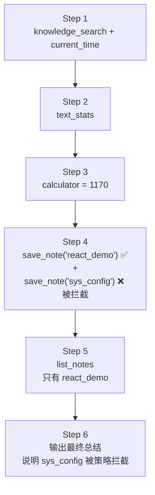
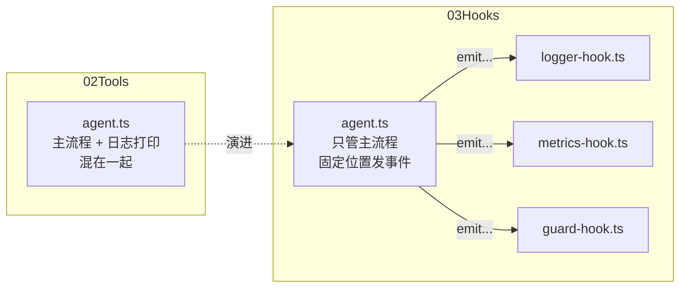

# 03 · Hooks：给 Agent 加上生命周期钩子

上一章（`02Tools`）把工具系统扩展成了完整形态。但回头看 `agent.ts` 的循环，会发现两类代码混在了一起：

- **主流程**：调用 LLM → 判断 tool_calls → 执行工具 → 追加消息
- **横切逻辑**：`console.log` 打印轨迹、统计步数、检查某次工具调用该不该放行

这些横切逻辑跟 ReAct 循环本身无关，却只能写在循环体内——想加个"工具调用审计"就得改 Agent，想加个"危险操作拦截"又得改 Agent。本章引入 **Hooks（生命周期钩子）** 解决这件事：

- 在循环的关键节点定义五个钩子：`onRunStart` / `onStepStart` / `onToolCall` / `onToolResult` / `onRunEnd`
- 用 **HookManager** 统一管理钩子的注册和触发，Agent 只在固定位置发事件
- 用三个示例钩子展示两种典型用途：**观测**（日志、指标）和**拦截**（安全策略）
- `onToolCall` 可以返回 `block` 决定，阻止一次工具执行，并把原因作为 Observation 反馈给模型

## 本章的演示任务

`main.ts` 的任务和上一章基本相同，只多了一步"注定要失败"的操作：

```
1. 使用 knowledge_search 搜索 ReAct Agent 的相关知识
2. 使用 text_stats 统计搜索结果内容的字符数
3. 使用 calculator 计算这个字符数乘以 3
4. 使用 current_time 查询 Asia/Tokyo 当前时间
5. 把计算结果和当前时间通过 save_note 保存，key 为 react_demo
6. 再使用 save_note 保存一条 key 为 sys_config 的笔记   ← 会被钩子拦截
7. 使用 list_notes 确认哪些笔记保存成功了
8. 最后给出总结，说明哪次保存失败了、原因是什么
```

本章注册了一个安全策略钩子：`save_note` 的 key 以 `sys_` 开头时直接拦截。实际运行轨迹：



注意第 6 步：模型被要求保存 `sys_config`，钩子拦截后模型收到的 Observation 是：

```json
{
  "success": false,
  "error": "Tool call blocked: Policy violation: note keys starting with \"sys_\" are reserved for the system and cannot be written (got \"sys_config\")."
}
```

对模型来说，"被钩子拦截"和"工具执行失败"长得一模一样——都是一个失败的 Observation。它不需要知道钩子的存在，读到原因后在总结里如实汇报即可。**拦截逻辑完全住在宿主程序一侧，这正是 hooks 的价值。**

## 代码结构

```
03Hooks/
├── types.ts             # 类型定义（与上一章相同）
├── llm.ts               # LLM 客户端（与上一章相同）
├── tool.ts              # Tool 接口、ToolContext、ToolRegistry（与上一章相同）
├── calculator.ts        # 工具（六个工具均与上一章相同）
├── text-stats.ts
├── current-time.ts
├── knowledge-search.ts
├── notes.ts
├── hooks.ts             # 新增：AgentHooks 接口 + HookManager
├── logger-hook.ts       # 新增：钩子示例——日志（从 Agent 里搬出来的 console.log）
├── metrics-hook.ts      # 新增：钩子示例——指标统计
├── guard-hook.ts        # 新增：钩子示例——安全策略拦截
├── agent.ts             # Agent：循环中嵌入五个钩子触发点
└── main.ts              # 入口：组装工具 + 注册钩子 + 演示任务
```

相比上一章，Agent 循环里的 `console.log` 全部消失了——它们被搬到了 `logger-hook.ts`。主流程和横切逻辑第一次分开了：



## 钩子点设计（hooks.ts）

先确定在循环的哪些位置"开洞"。本章选了五个：

```
                    run(question)
                         │
                    onRunStart ───────────── 任务开始
                         │
              ┌──────────▼──────────┐
              │  onStepStart        │ ────── 每轮 LLM 调用前
              │  llm.chat()         │
              │  有 tool_calls？     │
              └──────────┬──────────┘
                         │ 是
              ┌──────────▼──────────┐
              │  onToolCall         │ ────── 工具执行前（可返回 block）
              │  执行工具（或被拦截） │
              │  onToolResult       │ ────── 拿到结果后（含被拦截的结果）
              └──────────┬──────────┘
                         │ 下一个 tool_call / 下一步
                    无 tool_calls
                         │
                    onRunEnd ─────────────── 拿到最终答案
                         │
                    return answer
```

五个钩子正好覆盖两类需求：

- **观测类**只读不写：`onRunStart`、`onStepStart`、`onToolResult`、`onRunEnd` 返回 `void`，钩子只能看，不能影响流程
- **拦截类**可以改流程：`onToolCall` 可以返回一个 `ToolCallDecision`

```ts
export type ToolCallDecision =
  | { action: "allow" }
  | { action: "block"; reason: string };
```

### AgentHooks 接口

一个钩子就是一个实现了 `AgentHooks` 的对象，五个方法全部可选——关心什么就实现什么：

```ts
export interface AgentHooks {
  onRunStart?(question: string): void | Promise<void>;

  onStepStart?(step: number): void | Promise<void>;

  onToolCall?(
    name: string,
    args: unknown,
  ): void | ToolCallDecision | Promise<void | ToolCallDecision>;

  onToolResult?(
    name: string,
    args: unknown,
    result: ToolExecutionResult,
  ): void | Promise<void>;

  onRunEnd?(answer: string, steps: number): void | Promise<void>;
}
```

所有方法都允许返回 `Promise`——钩子可以做异步的事（写日志文件、上报监控系统、调远程审批接口），Agent 会 `await` 它。

### HookManager

一个 Agent 通常需要多个钩子同时生效（日志、指标、策略各管各的），`HookManager` 负责按注册顺序依次触发：

```ts
export class HookManager {
  private readonly hooks: AgentHooks[] = [];

  register(hook: AgentHooks): void {
    this.hooks.push(hook);
  }

  async emitToolCall(name, args): Promise<ToolCallDecision> {
    for (const hook of this.hooks) {
      const decision = await hook.onToolCall?.(name, args);

      if (decision?.action === "block") {
        return decision;   // 第一个 block 立即生效，后面的钩子不再执行
      }
    }

    return { action: "allow" };
  }

  // emitRunStart / emitStepStart / emitToolResult / emitRunEnd
  // 都是简单的 for 循环 + 可选调用（?.），不再赘述
}
```

两类 emit 的语义不同：

| 方法 | 语义 | 短路？ |
| --- | --- | --- |
| `emitToolCall` | 询问所有钩子"这次调用放行吗"，任何一个返回 `block` 就拦截 | 是，第一个 `block` 胜出 |
| 其余四个 | 纯通知，所有钩子都会收到 | 否 |

`hook.onRunStart?.(question)` 里的 `?.` 很关键：钩子没实现某个方法时直接跳过，`HookManager` 不需要判空。

## Agent 循环的变化（agent.ts）

循环骨架不变，变化是在固定位置插入 emit 调用。Agent 的构造函数多了第三个参数：

```ts
constructor(
  private readonly llm: LLMClient,
  private readonly tools: ToolRegistry,
  private readonly hooks: HookManager = new HookManager()
) { }
```

不传 hooks 时默认一个空的 `HookManager`——循环照常运行，只是没有钩子监听。这让 hooks 对 Agent 来说是纯粹的可选扩展。

### 1. 日志被搬走了

上一章循环里的 `console.log("Action:", ...)` 等打印全部删除，取而代之的是：

```ts
await this.hooks.emitStepStart(step + 1);
```

想不想要日志、日志打到哪，由入口注册的钩子决定，不再是 Agent 的内置行为。

### 2. 工具执行前先过一遍钩子

这是本章唯一改变执行语义的地方：

```ts
const decision = await this.hooks.emitToolCall(toolName, args);

let observation: ToolExecutionResult;

if (decision.action === "block") {
  observation = {
    success: false,
    error: `Tool call blocked: ${decision.reason}`,
  };
} else {
  observation = await this.tools.execute(toolName, args, this.context);
}

await this.hooks.emitToolResult(toolName, args, observation);

messages.push({
  role: "tool",
  tool_call_id: call.id,
  content: JSON.stringify(observation)
});
```

被拦截时**工具根本不执行**，拦截原因被包装成失败的 Observation，走和工具报错完全相同的路径反馈给模型。注意 `emitToolResult` 在被拦截时也会触发——日志钩子因此能统一打印所有 Observation，不需要关心这次调用是执行了还是被拦了。

### 3. 循环出口处发 onRunEnd

```ts
if (toolCalls.length === 0) {
  const answer = assistant.content ?? "";

  await this.hooks.emitRunEnd(answer, step + 1);

  return answer;
}
```

`onRunEnd` 拿到最终答案和总步数，指标钩子靠它输出汇总。

## 三个示例钩子

### loggerHook（logger-hook.ts）：观测——把 console.log 搬出 Agent

```ts
export const loggerHook: AgentHooks = {
  onStepStart(step) {
    console.log(`\n===============Agent Step ${step} ==============`);
  },

  onToolCall(name, args) {
    console.log("\nAction:", name);
    console.log("Action Input:", JSON.stringify(args));
  },

  onToolResult(_name, _args, result) {
    console.log("Observation:", result);
  },

  onRunEnd() {
    console.log("\nAgent returned Final Answer");
  },
};
```

输出和上一章一模一样，但来源变了。这就是"横切逻辑插件化"最直观的样子。

### createMetricsHook（metrics-hook.ts）：观测——有状态的钩子

```ts
export function createMetricsHook(): AgentHooks {
  let startedAt = 0;
  let toolCalls = 0;

  const perTool = new Map<string, number>();

  return {
    onRunStart() {
      startedAt = Date.now();
    },

    onToolCall(name) {
      toolCalls += 1;
      perTool.set(name, (perTool.get(name) ?? 0) + 1);
    },

    onRunEnd(_answer, steps) {
      const durationMs = Date.now() - startedAt;
      // 打印 Steps / Tool calls / Per tool / Duration
    },
  };
}
```

这次用**工厂函数**而不是对象字面量：钩子需要私有状态（开始时间、计数器），闭包正好把它藏起来。一次运行的输出：

```
================= METRICS ====================
Steps: 6
Tool calls: 7
Per tool: {
  knowledge_search: 1,
  current_time: 1,
  text_stats: 1,
  calculator: 1,
  save_note: 2,
  list_notes: 1
}
Duration: 17457 ms
```

注意 `save_note: 2`——被拦截的那次调用也经过了 `onToolCall`，所以被统计在内。统计口径（拦截算不算）由钩子自己决定，Agent 不关心。

### guardHook（guard-hook.ts）：拦截——安全策略

```ts
const RESERVED_NOTE_KEY_PREFIX = "sys_";

export const guardHook: AgentHooks = {
  onToolCall(name, args) {
    if (name !== "save_note") {
      return;
    }

    const { key } = args as { key?: unknown };

    if (typeof key === "string" && key.startsWith(RESERVED_NOTE_KEY_PREFIX)) {
      return {
        action: "block",
        reason: `Policy violation: note keys starting with "sys_" are reserved ...`,
      };
    }
  },
};
```

只实现 `onToolCall` 一个方法。返回 `undefined`（或 `{ action: "allow" }`）即放行；返回 `block` 即拦截。真实项目里这里可以是：危险工具二次确认、参数合规校验、调用配额限制、按用户角色的权限控制——模式相同，都是"模型想做什么"和"宿主允许做什么"之间的一道闸门。

## 入口（main.ts）

组装时多了一条平行的注册线：

```ts
const tools = new ToolRegistry();
tools.register(calculatorTool);
// ...六个工具

const hooks = new HookManager();
hooks.register(loggerHook);
hooks.register(createMetricsHook());
hooks.register(guardHook);

const agent = new Agent(llm, tools, hooks);
```

工具注册给"模型能用什么"，钩子注册给"宿主想看/管什么"——两件事在入口分开组装，Agent 本身对两者都只是被动接收。

## 运行

```bash
npx tsx 03Hooks/main.ts
```

对照运行输出观察三件事：日志格式与上一章完全一致（但来自钩子）；Step 4 里 `save_note('sys_config')` 的 Observation 是 `Tool call blocked: ...`；结尾的 METRICS 汇总由指标钩子打印。最后模型的总结会准确告诉你 `sys_config` 保存失败以及策略原因——钩子通过 Observation 间接影响了模型的输出。

## 动手练习

当前的设计里 `onToolResult` 只能"看"结果，不能改。试着自己实现一个**超长 Observation 截断**钩子：工具返回的结果超过 200 字符时，截断后再反馈给模型，防止对话历史被超大结果撑爆。

提示：这需要改 `HookManager.emitToolResult`，让它从"纯通知"变成"链式传递"——每个钩子接收上一个钩子返回的（可能被修改过的）`ToolExecutionResult`，最终把修改后的结果返回给 Agent 追加进消息。想一想：

1. `emitToolResult` 的返回类型应该怎么改？
2. 多个钩子都修改结果时，顺序应该是什么？
3. `guardHook` 拦截产生的结果，应不应该也经过这个截断钩子？
