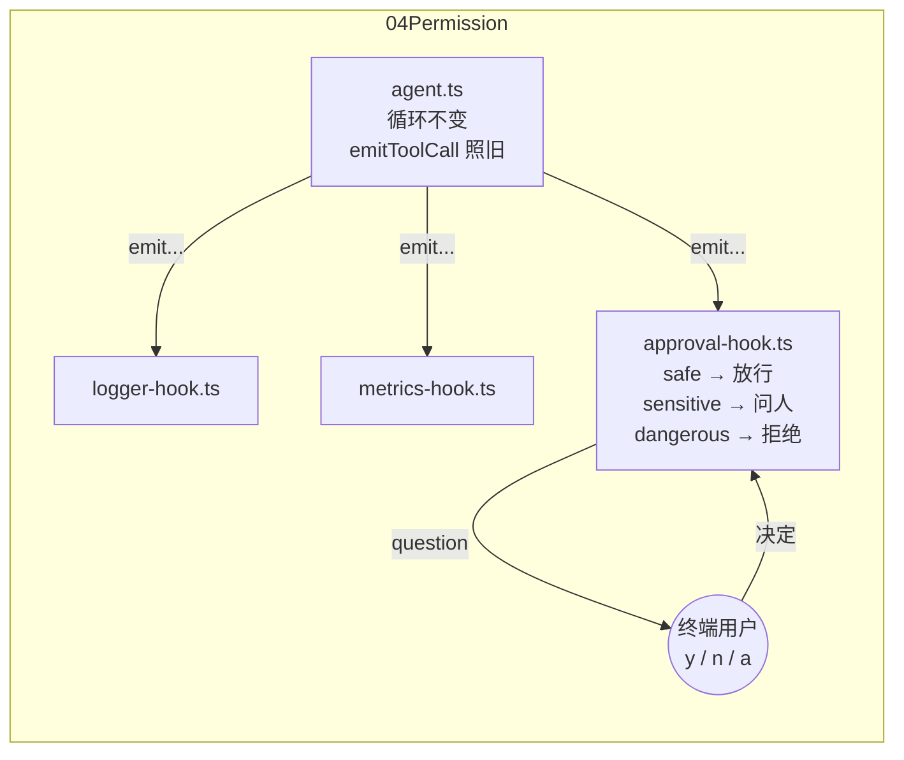

# 04 · Permission：给工具调用加上权限校验与审批

上一章（`03Hooks`）用 `guardHook` 演示了拦截：`save_note` 的 key 以 `sys_` 开头就直接 block。那是一条**静态规则**——策略写死在代码里，调用一到，规则自己就能判定放行还是拦截。

但真实场景里大量操作没法这么判：

- "删除一条笔记"危险吗？取决于删的是哪条、谁让它删的
- "发一封邮件"能放行吗？得让真人看一眼收件人和内容才知道
- 同一个工具，这次调用安全，下次调用可能就不安全

这类操作需要的不是静态规则，而是**权限模型 + 人工审批（human-in-the-loop）**。本章在 hooks 之上加一层权限系统：

- 用**三级风险模型**给工具分级：`safe` 自动放行、`sensitive` 暂停循环向人类请求审批、`dangerous` 一律拒绝
- 审批钩子通过 `readline` 在终端里问用户：批准（`y`）、拒绝（`n`）、本次运行内总是允许（`a`）
- 审批结果仍然走上一章的 `ToolCallDecision` 通道反馈给模型——**Agent 的代码一行都不用改**

## 本章的演示任务

`main.ts` 的任务链里埋了两种"敏感"操作：

```
1. 使用 knowledge_search 搜索 ReAct Agent 的相关知识
2. 使用 text_stats 统计搜索结果内容的字符数
3. 使用 calculator 计算这个字符数乘以 3
4. 把计算结果通过 save_note 保存，key 为 react_demo    ← sensitive，触发人工审批
5. 再使用 delete_note 删除 key 为 react_demo 的笔记    ← dangerous，直接拒绝
6. 使用 list_notes 确认笔记的当前状态
7. 最后给出总结，说明哪些操作触发了审批、哪个被拒绝、原因是什么
```

运行到第 4 步时，循环会**停下来等你输入**：

```
[permission] Approval required
  Tool: save_note
  Args: {"key":"react_demo","content":"..."}
  Approve this call? [y]es / [n]o / [a]lways:
```

- 输入 `y`：放行这一次
- 输入 `a`：放行，且本次运行内 `save_note` 不再询问
- 输入 `n`：拒绝，模型收到失败的 Observation

第 5 步的 `delete_note` 被分级为 `dangerous`，不询问、直接拒绝：

```json
{
  "success": false,
  "error": "Tool call blocked: Permission denied: tool \"delete_note\" is classified as dangerous and is not allowed to run."
}
```

注意这里和上一章 `guardHook` 的关键区别：上一章是"规则说拦就拦"，本章是"**规则定级别，级别决定是否问人**"。`sensitive` 这一级的存在，承认了有些判断只有人能做。

## 代码结构

```
04Permission/
├── types.ts             # 类型定义（与上一章相同）
├── llm.ts               # LLM 客户端（与上一章相同）
├── tool.ts              # Tool 接口、ToolContext、ToolRegistry（与上一章相同）
├── calculator.ts        # 工具（均与上一章相同）
├── text-stats.ts
├── current-time.ts
├── knowledge-search.ts
├── notes.ts             # 新增 delete_note 工具（本章的 dangerous 示例）
├── hooks.ts             # AgentHooks + HookManager（与上一章相同）
├── logger-hook.ts       # 日志钩子（与上一章相同）
├── metrics-hook.ts      # 指标钩子（与上一章相同）
├── permission.ts        # 新增：风险等级 + 权限策略
├── approval-hook.ts     # 新增：审批钩子（readline 交互式询问）
├── agent.ts             # Agent（与上一章完全相同，一行未改）
└── main.ts              # 入口：注册审批钩子 + 演示任务
```

最值得注意的一行：**`agent.ts` 与上一章完全相同**。权限系统是纯粹的钩子层增量——这正是上一章把横切逻辑拆出去换来的回报。上一章的 `guard-hook.ts` 被本章的权限系统取代，它的静态规则能力被 `dangerous` 级别吸收了。



## 权限模型（permission.ts）

核心是一个三级风险分类和一张策略表：

```ts
export type RiskLevel = "safe" | "sensitive" | "dangerous";

export interface PermissionPolicy {
  defaultLevel: RiskLevel;
  tools: Record<string, RiskLevel>;
}

export function riskLevelOf(policy, toolName): RiskLevel {
  return policy.tools[toolName] ?? policy.defaultLevel;
}
```

三个级别的语义：

| 级别 | 含义 | 行为 |
| --- | --- | --- |
| `safe` | 只读、无副作用 | 自动放行，不打扰用户 |
| `sensitive` | 有副作用但可逆/可审计 | 暂停循环，请求人工审批 |
| `dangerous` | 破坏性、不可逆 | 一律拒绝，不给审批机会 |

默认策略：

```ts
export const defaultPolicy: PermissionPolicy = {
  defaultLevel: "sensitive",   // 未知工具默认要审批（白名单思维）
  tools: {
    calculator: "safe",
    text_stats: "safe",
    current_time: "safe",
    knowledge_search: "safe",
    list_notes: "safe",
    save_note: "sensitive",
    delete_note: "dangerous",
  },
};
```

`defaultLevel: "sensitive"` 是个有意的选择：**没被策略显式覆盖的工具，默认按敏感处理**。新增一个工具却忘了配权限时，它不会悄悄获得自由通行证——宁可多问一次人。

## 审批钩子（approval-hook.ts）

用工厂函数创建（和 `createMetricsHook` 一样需要私有状态）：

```ts
export function createApprovalHook(policy: PermissionPolicy): AgentHooks {
  const rl = readline.createInterface({
    input: process.stdin,
    output: process.stdout,
  });

  const sessionAllowed = new Set<string>();  // 本次运行内 "always" 过的工具

  return {
    async onToolCall(name, args) {
      const level = riskLevelOf(policy, name);

      if (level === "safe") return;                      // 放行
      if (level === "dangerous") {
        return { action: "block", reason: "..." };       // 直接拒绝
      }
      if (sessionAllowed.has(name)) return;              // 本会话已永久允许

      // sensitive：打印待审批调用，等用户输入
      const answer = await ask("  Approve this call? [y]es / [n]o / [a]lways: ");

      if (answer === "a") { sessionAllowed.add(name); return; }
      if (answer === "y") return;
      return { action: "block", reason: "..." };         // 人拒绝了
    },

    onRunEnd() {
      rl.close();   // 释放 readline，否则进程不退出
    },
  };
}
```

几个设计点：

- **`onToolCall` 是 async 的**。上一章就埋好了这条路——`AgentHooks` 所有方法都允许返回 `Promise`，Agent 会 `await`。所以"停在这里等用户敲键盘"这件事，钩子层天然支持，循环代码不用动。
- **审批决定走 `ToolCallDecision` 通道**。人拒绝时返回 `block`，原因被包装成失败的 Observation 反馈给模型，和工具报错、静态拦截长得一模一样。模型读到 `"Permission denied by the human operator"` 后会在总结里如实汇报。
- **`sessionAllowed` 记住 "always"**。同一次运行里用户对一个工具点过 `a`，后续调用不再询问——这是真实 Agent 工具（Claude Code、Cursor 等）的标准交互。
- **`onRunEnd` 里关 readline**。打开的 readline 接口会挂住 stdin 让进程无法退出，用完必须关。
- **stdin 关闭时自动拒绝（fail-closed）**。stdin 提前 EOF（比如管道喂输入、CI 环境）时 readline 会直接关闭，此时再问 `rl.question` 会抛 `ERR_USE_AFTER_CLOSE`。钩子监听 `close` 事件，发现无法与人交互时一律按"拒绝"处理——**问不到人，就当人说了不**，这是审批系统的安全默认值。

## 入口（main.ts）

组装方式上一章完全一样，只是注册的钩子换了：

```ts
tools.register(saveNoteTool);
tools.register(deleteNoteTool);   // 新增的危险工具
tools.register(listNotesTool);

const hooks = new HookManager();
hooks.register(loggerHook);
hooks.register(createMetricsHook());
hooks.register(createApprovalHook(defaultPolicy));
```

## 运行

```bash
npx tsx 04Permission/main.ts
```

注意这是一次**交互式运行**：循环走到 `save_note` 时会停下来等你在终端输入 `y` / `n` / `a`。建议多跑几次、每次给不同答案，观察模型最终总结的变化：

- `save_note` 批了、`delete_note` 被拒 → `list_notes` 里 `react_demo` 还在，模型会解释删除被权限系统拒绝
- `save_note` 拒了 → 后续的删除请求因为笔记不存在/仍被拒而失败，模型的总结也随之改变

同一个任务、同一份代码，**人的审批决定改变了运行轨迹**——这就是 human-in-the-loop 的含义。

## 动手练习

当前的 `riskLevelOf` 只看工具名，不看参数。试着把它改成**参数级策略**：

```ts
export function riskLevelOf(
  policy: PermissionPolicy,
  toolName: string,
  args: unknown,
): RiskLevel
```

然后实现这条规则：`save_note` 默认是 `sensitive`，但当 key 以 `sys_` 开头时升级为 `dangerous`——也就是把上一章 `guardHook` 的静态规则表达成权限模型里的一次"级别升级"。想一想：

1. 策略表 `Record<string, RiskLevel>` 还够用吗？是不是该允许 `tools[name]` 是一个返回级别的函数？
2. 级别升级后，`approval-hook.ts` 需要改吗？（提示：不需要，它只消费 `riskLevelOf` 的结果——策略的复杂度被收拢在了一个函数里。）
